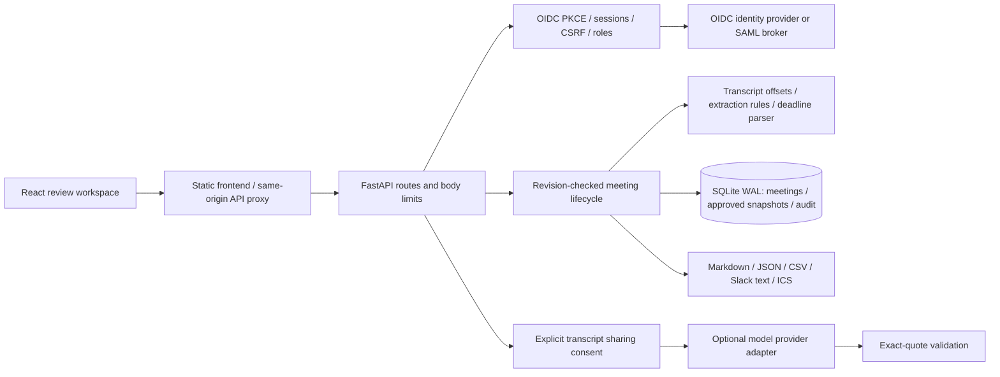

# Meeting Minutes — Alan Vo

A meeting-record workspace with **source-linked extraction, independent approval and action tracking**. Import an English text transcript, review proposed actions and decisions against exact quotes, then preserve approved minutes while tracking follow-through.

This release replaces the original CLI-only implementation with a FastAPI backend, React/TypeScript frontend, persistent SQLite storage and OIDC sign-in. The CLI remains available for offline extraction. It accepts **text transcripts, not audio**.

## Three complete workflows

1. **Transcript to draft:** enter a title, meeting date, participant roster and transcript. Inspect deterministic candidates beside the original turns, adopt useful candidates and correct their wording, owners or dates. Every item retains a server-validated exact source quote.
2. **Draft to approved minutes:** submit the draft, sign in as an independent reviewer, approve or request changes. Content edits are frozen during review. Approval stores an immutable snapshot. Reopening creates a new working draft without altering the old approved record.
3. **Minutes to follow-through:** move actions through open, in-progress, blocked, done or cancelled states with reasons. Export working or approved records as Markdown, JSON, CSV, Slack text or an all-day ICS calendar. Nothing is automatically posted or scheduled elsewhere.

Optional model assistance suggests additional **exact source excerpts**. It never mutates a meeting automatically and requires explicit consent before sending transcript text to the configured endpoint. Rule extraction, review and export work without any model or API key.

## Architecture



`backend/app/domain` contains transcript parsing, extraction, deadline rules, item validation and exports. `services` implements transactional state changes, optional suggestions and a reproducible extraction diagnostic. `core` handles configuration, persistence primitives and authentication. Frontend modules separate import, proposal review, item editing, approvals, audit and evaluation.

## Local development / demo

Requirements: Python 3.11+ and Node 22+. Run commands from the repository root.

```bash
python3 -m venv .venv
.venv/bin/pip install -r backend/requirements.txt
AUTH_MODE=demo APP_ENV=development COOKIE_SECURE=false BIND_HOST=127.0.0.1 \
  PYTHONPATH=backend .venv/bin/uvicorn app.main:app --host 127.0.0.1 --port 8000
```

In another terminal:

```bash
cd frontend
npm ci --no-audit --no-fund
npm run dev
```

Open **http://127.0.0.1:5173**. Use **Continue as analyst**, create a meeting and load the sample transcript. Adopt its candidates and submit. Sign out, then use **Continue as reviewer** to approve. Use **admin** only for deletion or workspace administration.

Demo mode is explicitly local-only: it refuses production configuration and non-loopback clients. It is not an authentication mechanism for a shared server. The default authentication mode is OIDC. Local database files live under `data/` and are ignored by Git.

## Production Docker deployment

```bash
cp .env.example .env
# Edit the real HTTPS origin, OIDC discovery/client/redirect settings and optional model settings.
docker compose config
docker compose up --build -d
```

Compose runs the backend as UID 10001, the static frontend as the unprivileged nginx user, and persists SQLite in a named volume. Only the frontend binds to the host, at **127.0.0.1:8090**. Put an HTTPS reverse proxy in front of that port. Set `FRONTEND_URL` and `OIDC_REDIRECT_URI` to the public HTTPS origin. Compose forces production OIDC mode and secure cookies; use the local commands above for demo access.

Do not expose the development server or demo mode publicly. Deploy one backend process per SQLite database. Use an identity-provider group to restrict membership: this version is a **single shared workspace**, not a multi-tenant product. Every authenticated workspace viewer can read all meetings.

### OIDC and SAML SSO

Register an authorization-code client with callback `/api/auth/callback`. Discovery and signed ID-token validation verify issuer, audience, expiry, nonce and authorized-party constraints. Login uses PKCE and browser-bound, single-use state. The app stores opaque sessions server-side, not browser-readable bearer tokens. Mutations require the session's CSRF token.

Map the configured role claim (default `realm_access.roles`) to:

| Role | Permissions |
|---|---|
| `viewer` | Read meetings, audit, diagnostics and exports |
| `reviewer` | Viewer access plus draft editing, submission, independent review, action changes and optional model requests |
| `admin` | Reviewer access plus deletion |

A user who created, edited, reopened or submitted the minutes cannot approve them, including admins. Unknown roles fall back to viewer; restrict which users may sign into the client at the IdP.

For **SAML**, use an identity broker such as an organization-managed Keycloak realm or equivalent: the broker accepts and validates the SAML assertion, then presents OIDC to this app. This app does **not** expose a native SAML ACS endpoint. Configure claim/role mapping in the broker and register the OIDC callback above.

### Optional LLM configuration

One `LLM_API_KEY` enables the default provider selection: Anthropic-style and Gemini-style key prefixes select their native adapters; other keys select the OpenAI-compatible adapter. Explicit settings override that convenience. Endpoint/model identifiers vary by deployment; set `LLM_MODEL` to a model available to your account rather than assuming one universal “latest” model.

| Setting | Behavior |
|---|---|
| `LLM_API_KEY` | Server-only credential; never sent to the frontend |
| `LLM_PROVIDER` | `auto`, `openai-compatible`, `openai`, `anthropic`, `gemini`, or `ollama` |
| `LLM_BASE_URL` | API root, e.g. an OpenAI-compatible `/v1` endpoint |
| `LLM_MODEL` | Model ID exposed by the endpoint |
| `LLM_TIMEOUT_SECONDS` | Bounded request timeout, default 30 |

For an OpenAI-compatible proxy, set provider, base URL and exposed model ID; one API key is used. For local Ollama, use `LLM_PROVIDER=ollama`, its `/v1` URL and an installed model; a key is not required. Default model IDs are convenience defaults, not a guarantee of availability or pricing. No model calls occur during tests or normal deterministic extraction. Provider usage can incur charges when a user explicitly requests suggestions.

Suggestions are limited to 30,000 transcript characters and 20 returned candidates. The server rejects unknown turn IDs, invented quotes and text not present in its claimed quote. Exact quotation proves provenance, **not semantic correctness**: a model can still select an irrelevant passage. People must review all suggestions. Provider failures leave saved work intact and return a sanitized error.

## Input and extraction contract

Each nonempty line is one source turn. Use `Alex: text` or `[00:01] Alex: text`. Speaker labels match roster entries ignoring case; unknown labels remain visibly unresolved. `ACTION:`, `TODO:`, `DECISION:`, `AGREED:` and `QUESTION:` are content cues, not speaker names. Offsets and the SHA-256 fingerprint refer to the stored transcript after CRLF normalization and trimming its outer whitespace.

The English rules recognize explicit action cues, first-person commitments, explicit decisions and questions. They intentionally do not attempt unrestricted semantic inference. Conditional/negative wording is flagged. Unknown owners and deadlines remain blank. Reviewers may correct item text, but each item must retain at least one exact source citation; manual corrections are distinguished from rule proposals and audited.

Dates resolve from the **meeting date**: ISO `YYYY-MM-DD`, today, tomorrow, “in N days” (up to 365), and weekdays. A bare weekday includes the same day; “next Friday” is strictly in the future if the meeting is Friday. Ambiguous numeric dates, “soon”, business-day calculations and time-of-day deadlines require human confirmation. Calendar exports use all-day events; no timezone or attendee addresses are invented.

Bounds: 100,000 transcript characters, 1,000 turns, 4,000 characters per turn, 50 participants, 200 proposals/items per meeting, 200 stored meetings, 25 approved snapshots per meeting, 5,000 audit events and a default 5 MiB HTTP body limit. The audit endpoint shows the latest 200 events. Retention is bounded; export records your organization needs to keep longer.

## API reference

Interactive OpenAPI: `/docs`. Health: `GET /api/health`. JSON errors use `{"error":{"code":"...","message":"..."}}`; schema validation uses FastAPI's `detail` response. Mutations require authentication and `X-CSRF-Token` from `/api/auth/me`.

| Method / path | Purpose |
|---|---|
| `GET /api/auth/mode`, `/api/auth/me` | Login mode and current identity/CSRF token |
| `GET /api/auth/login`, `/api/auth/callback` | OIDC authorization-code flow |
| `POST /api/auth/demo?identity=analyst` | Explicit local-only demo login |
| `POST /api/auth/logout` | Revoke session; returns 204 |
| `GET /api/meetings?q=&status=` | Bounded meeting list and action counts |
| `POST /api/meetings/preview` | Validate and extract without persisting |
| `POST /api/meetings` | Create a draft with immutable transcript |
| `GET /api/meetings/{id}` | Full record, source turns and review warnings |
| `POST /api/meetings/{id}/adopt` | Adopt selected proposal IDs into draft |
| `POST /api/meetings/{id}/items` | Add a sourced item |
| `PUT /api/meetings/{id}/items/{item}` | Correct a draft item |
| `DELETE /api/meetings/{id}/items/{item}` | Remove a draft item |
| `POST /api/meetings/{id}/submit` | Freeze draft for review |
| `POST /api/meetings/{id}/review` | Approve or request changes with note |
| `POST /api/meetings/{id}/reopen` | Reopen with a reason; keep approved snapshots |
| `POST /api/meetings/{id}/items/{item}/transition` | Change approved action status with reason |
| `GET /api/meetings/{id}/releases` | Approved snapshot revisions |
| `GET /api/meetings/{id}/export/{format}?release=N` | Export current or approved record |
| `POST /api/meetings/{id}/suggestions` | Explicit optional model request with `consent:true` |
| `DELETE /api/meetings/{id}` | Admin deletion of record/snapshots; audit remains |
| `GET /api/audit?meeting_id=` | Audit events |
| `GET /api/evaluation` | Deterministic extraction diagnostic |

All existing-record mutations carry an integer `revision`. A stale revision returns **409**, without applying partial changes. Reload and reconcile edits; do not blindly retry. Item bodies include `kind`, `text`, `owner`, `due_date`, `status`, `note` and `evidence:[{"turn_id":"t0001","quote":"exact excerpt"}]`. Approval uses `decision:"approve"|"request_changes"` and `note`. Exports support `markdown`, `json`, `csv`, `slack` and `ics`.

## CLI compatibility

```bash
.venv/bin/python main.py minutes --file samples/release-review.txt --meeting-date 2026-10-09
.venv/bin/python main.py actions --file samples/release-review.txt --assign
.venv/bin/python main.py slack --file samples/release-review.txt --channel '#engineering'
.venv/bin/python main.py followups --file samples/release-review.txt --start-date 2026-10-09
```

`--stdin`, `--output`, `--title` and `--participants 'Alex,Sam'` are supported. Without an explicit roster, only literal speaker labels are used. `--assign` is retained for compatibility; explicit owner extraction is always enabled. `--channel` never causes a Slack post. `--start-date` aliases the meeting-date anchor. Follow-ups list only dated extracted actions, without inventing attendees or scheduling times. CLI output is an **unapproved draft**, not a substitute for the web review workflow.

## AI/ML evaluation and tests

```bash
PYTHONPATH=backend .venv/bin/python -m pytest backend/tests -q
PYTHONPATH=backend .venv/bin/python -m app.services.evaluation
cd frontend
npm ci --no-audit --no-fund
npm run build
npm test -- --run
```

The diagnostic scores 24 manually labeled English snippets by first-candidate kind and reports precision, recall, F1, false positives, missed candidates and per-case results. Conditional statements, rhetorical questions and implicit commitments are included, so failures remain visible. Owner agreement is conditional on correctly detected actions. This is a small regression/behavior diagnostic, **not a representative production benchmark** or a trained-model accuracy claim.

Tests cover exact normalized source offsets, citation rejection, deadline ambiguity/date boundaries, Unicode/calendar folding, spreadsheet-formula escaping, optimistic concurrency, review separation even after an editor's item is removed, immutable approved snapshots, role/CSRF/session enforcement, signed OIDC/PKCE callbacks, provider adapters with mocked responses and browser-component workflows. CI uses standard hosted runners for this public repository and builds both containers; no model credentials are required.

## Operations and limitations

Back up SQLite with its backup API or stop the backend before copying the volume; do not copy only the live `.db` while ignoring WAL files. Keep backups encrypted and restrict volume access. Health checks report process availability, not IdP/model availability. Model failures do not block offline extraction or saved records. This workspace has no email delivery, audio transcription, calendar integration, scheduled reminders, speaker diarization or multi-tenant isolation.

MIT license. Maintained by **[Alan Vo](https://github.com/ALANDVO)** — **alanvo@gmail.com**.
